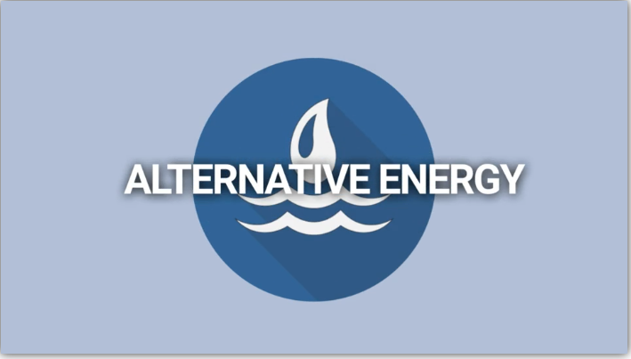
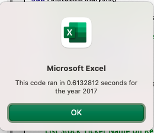
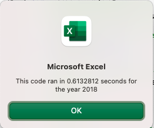
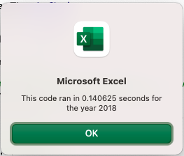
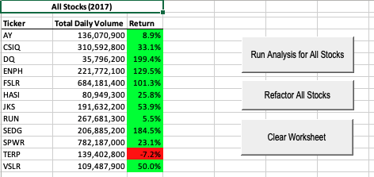
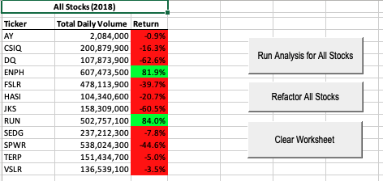

# STOCK ANALYSIS

## Overview of Project
In this project, my goal was to investigate all Alternative Energy stock 
corporations, for my parents, to provide the best information that
they can use to properly decide where to invest their retirement income.

## Purpose
The purpose of this analysis was to determine if their preference of DAQO
New Energy Corp was a wise decision, or if other corporatations, that focus
on developing geothermal, bio, wind or hydro engery platforms would serve
them better for their financial goals.

## Analysis and Challenges
The biggest challenge to this analysis was that I didn't want to make a mistake 
for them.  I am new to the financial business, and they are my parents, so
of course I want the best for them. So I dug in and looked at all of the
corporations, in new forms of green energy, and looked at their stock performance
over the past 2 years, 2017 and 2018.

Immediately, the outcome for DAQO was very apparent and that my parents should 
not be investing with them. Their return has been below 3 in both 2017 and 2018,
with it being 1.994 and -0.63 respectively.  Stocks with a below 3 return
are not a great place to start for investers that are older and need
a shorter time to save for retirement.

### Challenges and Difficulties Encountered
Data Analysis of stocks is tricky as in this case, it doesn't take into
effect things such as:
1. How long have these business' been in business?
2. Are they government subsidized?
3. Is 2 years really a long enough time to gauge how the company is really doing? 
4. Did Steve learn how to read trends, and study Stock Analysis in his courses?

## Results
Based on what I observed, the 2 companies I would recommend for my parents to invest
in are Enphase Energy, Inc (ENPH) and First Solar, Inc (FLSR).  If they want a 3rd 
company then I would recommend Sunrun, Inc (RUN).  Their performances in 2017 and
2018 were both positive and well above a return of 3.
   
### Overview of Project for Class
In this project, we were to work on writing macros in VBA, utilizing
loops, variables, ranges, formatting, arrays, etc.

### Analysis of my initial attempt at VBA 
My first attempt at writing some VBA to analyize all of the green energy
corporations, I felt went very well.  I even was able to create buttons
to help me run the app from the screen.  The performance was good and
the output did show the proper results and the formatting was not difficult
once I sat down and thought about how I use Excel every day.

My performance for the 2017 & 2018 runs, for my first attempt are shown here:

---

### Analysis and Advantages of my rework in VBA
When I came to the rework code, I jumpped in and just started going, and looking
up how the syntax for an array is defined, etc.  Then when I got to the bottom
portion, I referenced my original code and started just putting it in there
with the new array's and variables for the index values.  This rework came 
along very quickly and made sense right away to me.  So the rework of the VBA
code, definitely enhanced my VBA skillset and the overall improvement
in time, as it was a 77% improvement!

---

### Challenges and Difficulties Encountered with my rework attempts in VBA
My difficulties were typical Jill, I had some simple typos with using the same
word over and over - tickers, tickerVolume, etc - in some cases they wanted 
tickers and others it was ticker.  The typing mistakes also don't "stick out" 
like they do in the daily IDE I use. The other issues were due to syntax as 
I code all day in PL/SQL for Oracle and my automatic coding standards, such 
as to put a carrage return to not allow the line to become too long - breaks 
VBA. This makes it so I am unable to see what I am doing wrong in VBA when 
something fails.  So thank goodness for Saturday and Office Hours.

Here are the screen shots of my finished code for the challenge:

---

### Advantages and Disadvantages in Reworking Code in General
The advantages for refactoring code in general I think certainly 
outweight not performing them.  As you move along in your career,
you learn more skills and you can definitely apply them to any piece 
of code you are working on.  As software updates and new features come 
along, the old techniques may not work or may work much slower with the 
new compilers and optimizers.  In my world, we have to run sql statements 
through an optimizer every time Oracle changes their optimizer, otherwise 
the hints or plans we put into them can actually make the new optimizer 
work slower.  So you definitely need to rework code on a regular basis.   

There are some disadvantages to reworking code in general. You can spend 
all of your time reworking code, that you never work on new code, or actually
spanning out and making your application doing new things.  I actually
worked with a gentleman that spent his entire day, for months, proving
he could take a 15 line program and get it to be in 1 line in Perl. That
maybe a cool challenge, but to spend your workday doing this, really 
doesn't benefit your employer, or the actual piece of program you are
working on.

Thanks for the opportunity to provide this analysis for you.

Jill Hughes
